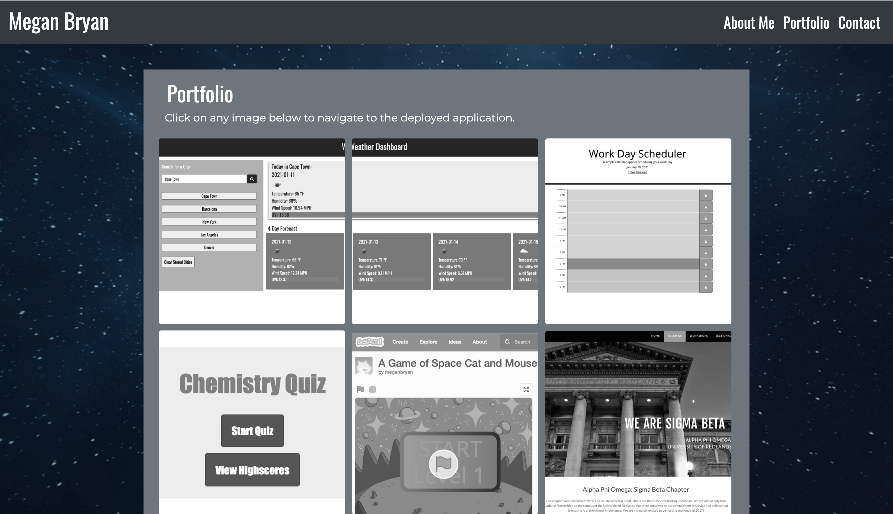
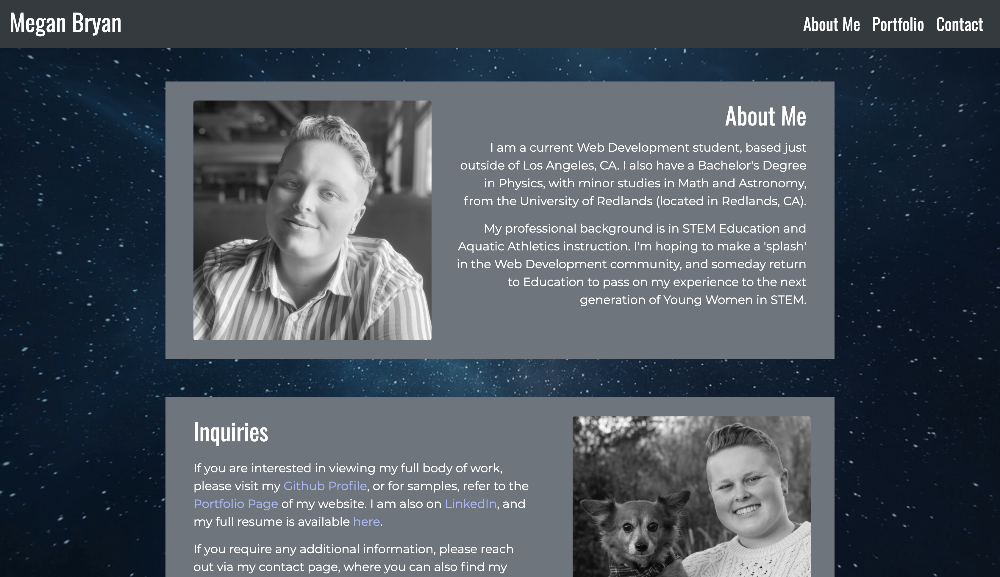
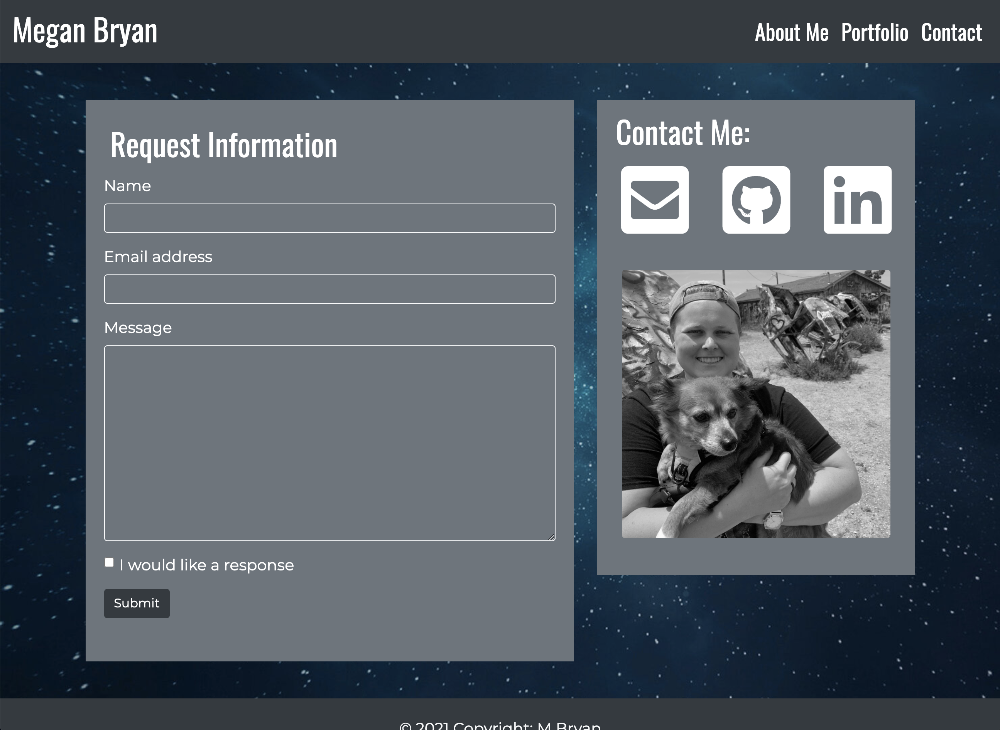

# Web Development Portfolio
#### This is my Web Development Portfolio, last updated on January 12th, 2021.

## The purpose of this website is to showcase my portfolio, and provide potential clients access to my contact information. Currently, my "Portfolio" page is showcasing the work I have done during my time as a Web Development student. My "About Me" page gives a bit of my background, and provides links to all relevant social pages, such as GitHub, LinkedIn, and my resume. The three pages are accessible using the navigation titles. My name is linked to my "About Me" page, but will later potentially be linked to a homepage. My website is space themed, as my background is in Astronomy and Physics, and that will be the lense I bring with me into my career as a web developer. 

### Link to my Deployed Application: [Web Development Portfolio](https://meganbryan.github.io/WebDevelopmentPortfolio/)

### 
### 
### 
