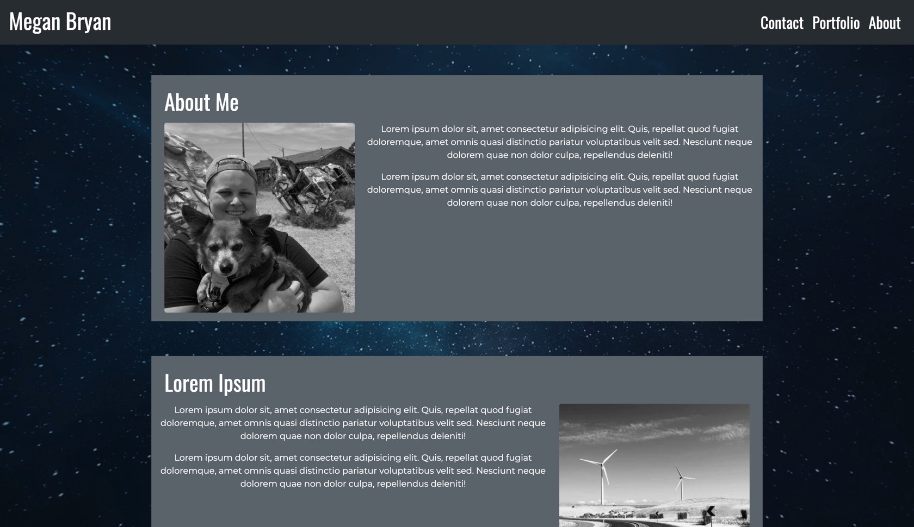
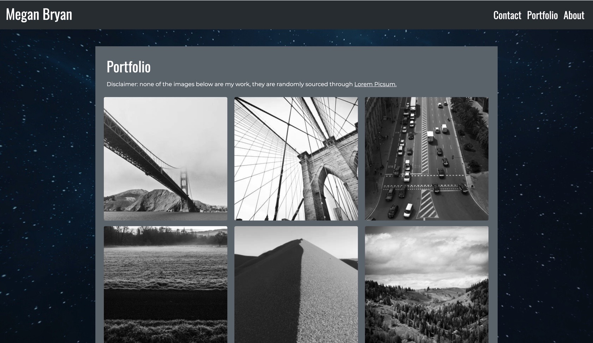
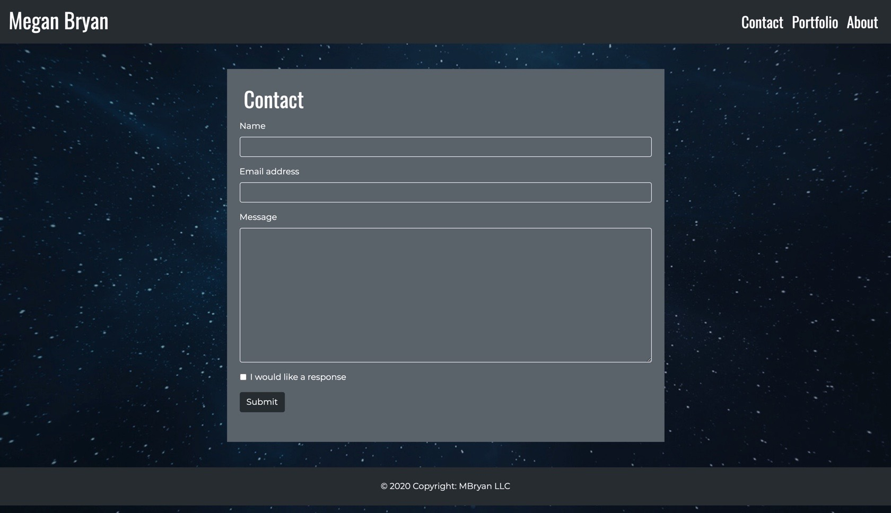

# ResponsivePortfolio
#### This is the repository for Homework 2, due November 14th, 2020.

## The purpose of this website is to showcase my portfolio, and provide potential clients access to my contact information. Currently, this page is serving as a skeleton for future works. I am using placeholder text and images, which will later be replaced by meaningful information. The three pages are accessible using the navigation titles. My name is currently linked to my "About Me" page, but will later be linked to a homepage. My website is space themed, as my background is in Astronomy and Physics, and that will be the lense I bring with me into my career as a web developer. 

### [Responsive Portfolio ](https://meganbryan.github.io/ResponsivePortfolio/)

### 
### 
### 

